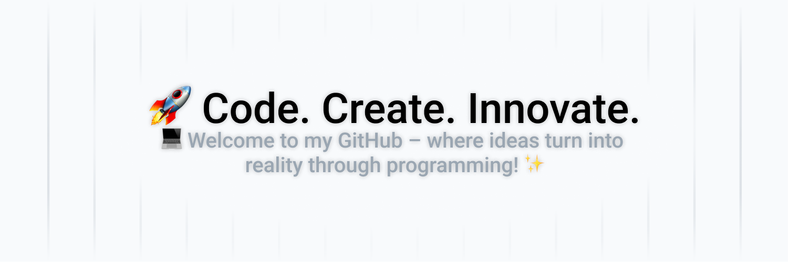

# Hello World!, I'm Blaz, a Self Learning Dev:
👨🏼‍🎓studying programming at [Srednja Tehniška Šola](https://sckr.si/sts/) 👨🏼‍💻working on my own projects for fun and to learn more

#💻Tech Stack: 
      

